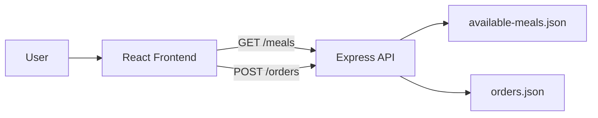
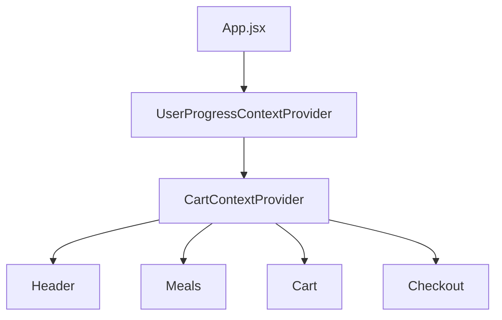
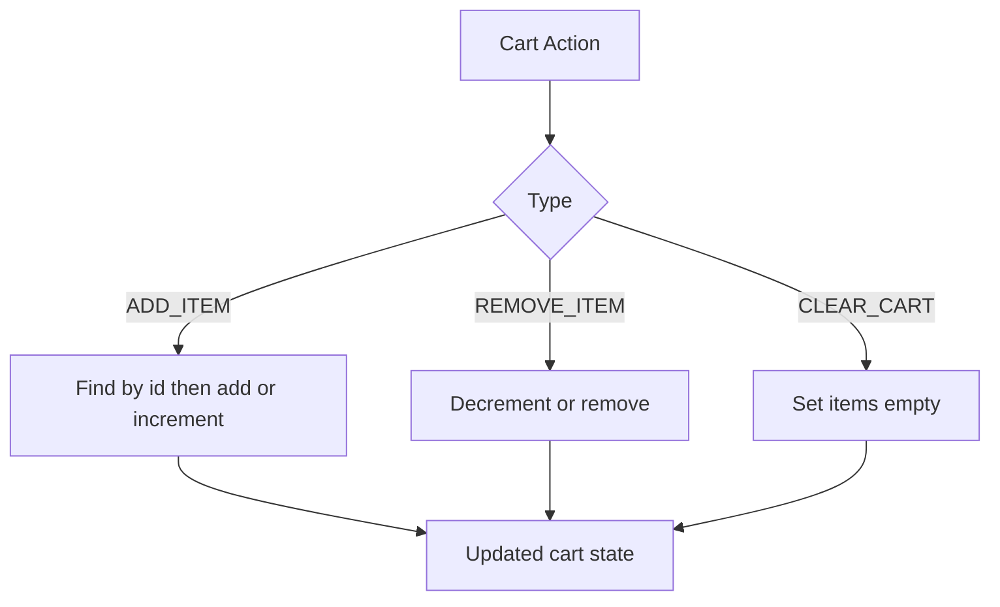
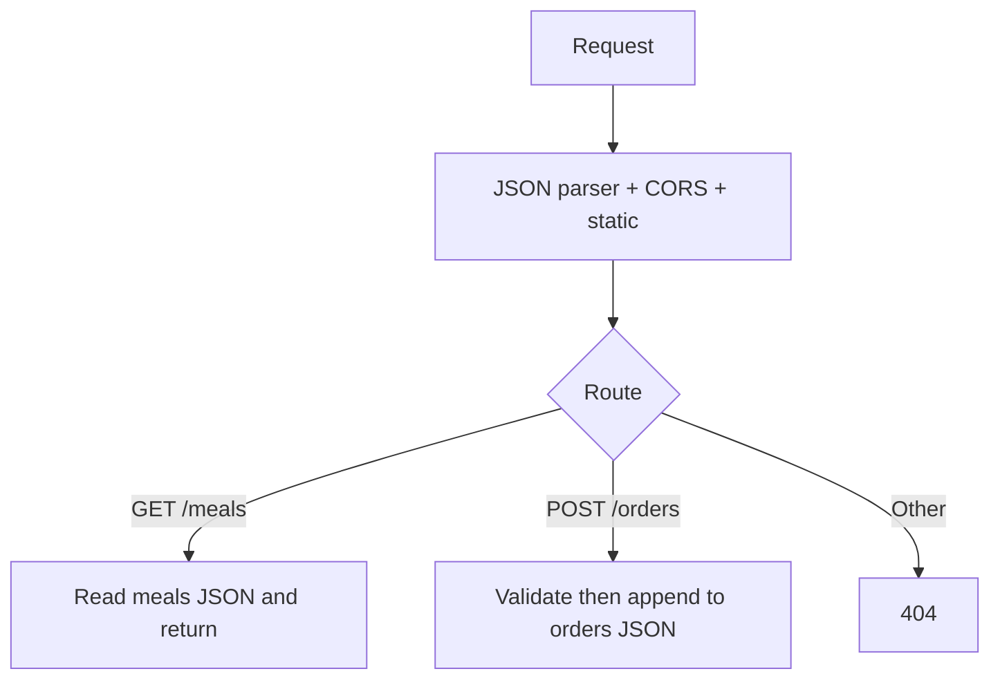
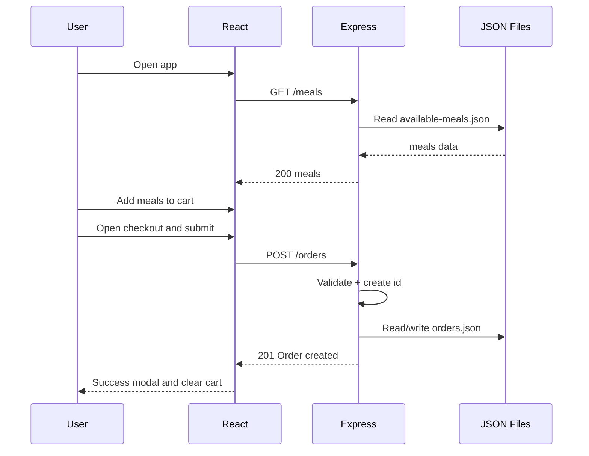
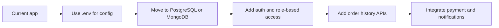

## Demo Link:

🔗 Live Demo: https://new-food-repo.vercel.app

🌐 Explore the deployed application and test the food ordering workflow.


# Food App - Complete Project Explanation

---

## 1) What this project does

This is a full-stack food ordering app.

Users can:
- view meals
- add meals to cart
- increase/decrease quantity
- open checkout
- submit an order

The backend validates the order and saves it in a JSON file.

---

## 2) Tech stack

| Layer | Tech | Purpose |
|---|---|---|
| Frontend | React 19 + Vite | UI rendering and interactions |
| State | Context API + useReducer | Cart and modal flow state |
| Network | Browser fetch (custom hook) | API calls |
| Backend | Node.js + Express 4 | APIs and static files |
| Storage | JSON files in `backend/data` | meals and order persistence |

---

## 3) High-level architecture



Simple meaning:
- Frontend asks backend for meals.
- Frontend sends order to backend.
- Backend reads/writes JSON files.

---

## 4) Frontend architecture

Main app composition is in `src/App.jsx`:

- `UserProgressContextProvider`
  - `CartContextProvider`
    - `Header`
    - `Meals`
    - `Cart`
    - `Checkout`

This means all major components can access global state from contexts.



---

## 5) Key frontend files and responsibilities

### Core
- `src/main.jsx`: app entry, React StrictMode, mount to `#root`
- `src/App.jsx`: provider tree and core component structure

### State
- `src/store/CartContext.jsx`:
  - cart reducer
  - actions: `ADD_ITEM`, `REMOVE_ITEM`, `CLEAR_CART`
- `src/store/UserProgressContext.jsx`:
  - controls modal step: `''`, `'cart'`, `'checkout'`

### API layer
- `src/hooks/useHttp.js`:
  - handles loading, error, data
  - auto-fetch for GET
  - manual request for POST

### UI Components
- `src/components/Header.jsx`: shows cart count and opens cart modal
- `src/components/Meals.jsx`: fetches meals and renders list
- `src/components/MealItem.jsx`: single meal card, add to cart
- `src/components/Cart.jsx`: cart modal with total and checkout button
- `src/components/Checkout.jsx`: form submit to create order
- `src/components/UI/Modal.jsx`: dialog + portal

---

## 6) Cart state logic 

`CartContext` uses `useReducer`.

### ADD_ITEM
- if item already exists by `id`: increase `quantity`
- else: add new item with `quantity: 1`

### REMOVE_ITEM
- if quantity is 1: remove item
- else: decrease quantity by 1

### CLEAR_CART
- reset items to empty array



---

## 7) Modal flow logic

`UserProgressContext` controls which modal is open:
- `''` => no modal
- `'cart'` => cart modal open
- `'checkout'` => checkout modal open

This app does not use React Router for pages. It uses modal-based flow.

---

## 8) API flow from frontend

### Meals load flow
1. `Meals.jsx` calls `useHttp('http://localhost:3000/meals', {}, [])`
2. `useHttp` auto-calls GET on mount
3. backend returns meals list
4. meals render in UI

### Order submit flow
1. user fills checkout form
2. `Checkout.jsx` collects `FormData`
3. creates payload:
   - `order.items` from cart
   - `order.customer` from form
4. sends POST to `http://localhost:3000/orders`
5. backend validates and stores order
6. success modal shown
7. cart cleared

---

## 9) Backend architecture

All backend logic is in `backend/app.js`.

### Middleware
- `bodyParser.json()` for JSON body parsing
- `express.static('public')` for static assets
- CORS headers for cross-origin frontend access

### Routes
- `GET /meals`
  - reads `backend/data/available-meals.json`
  - returns parsed meals array

- `POST /orders`
  - reads `req.body.order`
  - waits 1 second (simulated delay)
  - validates items and customer fields
  - adds random id
  - reads `backend/data/orders.json`
  - appends order and writes file
  - returns `201 { message: 'Order created!' }`

- fallback handler
  - `OPTIONS` => 200
  - unknown routes => 404 `{ message: 'Not found' }`



---

## 10) Data model

### Meal object (`available-meals.json`)
- `id`
- `name`
- `price` (string)
- `description`
- `image`

### Order object (`orders.json`)
- `id` (random string generated on server)
- `items` (array of cart items with quantity)
- `customer`
  - `name`
  - `email`
  - `street`
  - `postal-code`
  - `city`

---

## 11) End-to-end sequence chart



---

## 12) How to run project locally

Backend terminal:

```bash
cd backend
npm install
npm start
```

Frontend terminal (project root):

```bash
npm install
npm run dev
```

Open the Vite URL and use the app.

---

## 13) What is good in this project

- clean component split
- proper context-based state management
- reducer-based cart logic
- reusable networking hook (`useHttp`)
- clear API contract
- end-to-end full-stack flow is easy to explain

---

## 14) Current limitations 

- no authentication
- no payment gateway
- no real database (JSON storage only)
- hardcoded backend URL in frontend
- random id generation is not collision-safe
- no advanced schema validation library
- possible race condition on concurrent file writes

---

## 15) Production improvement roadmap


---
